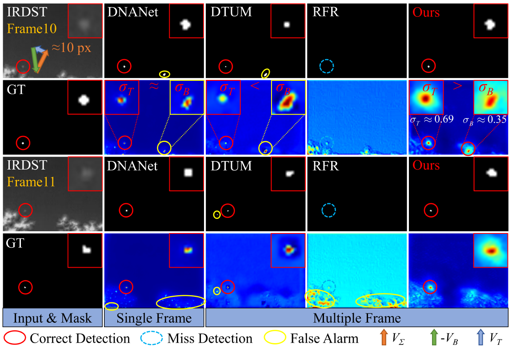
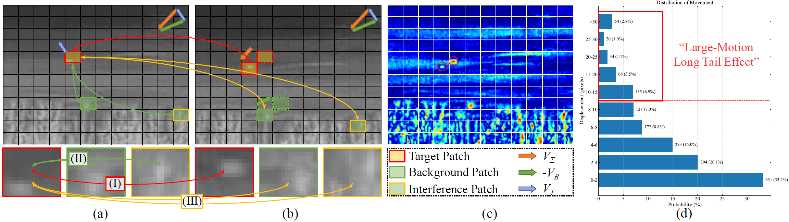
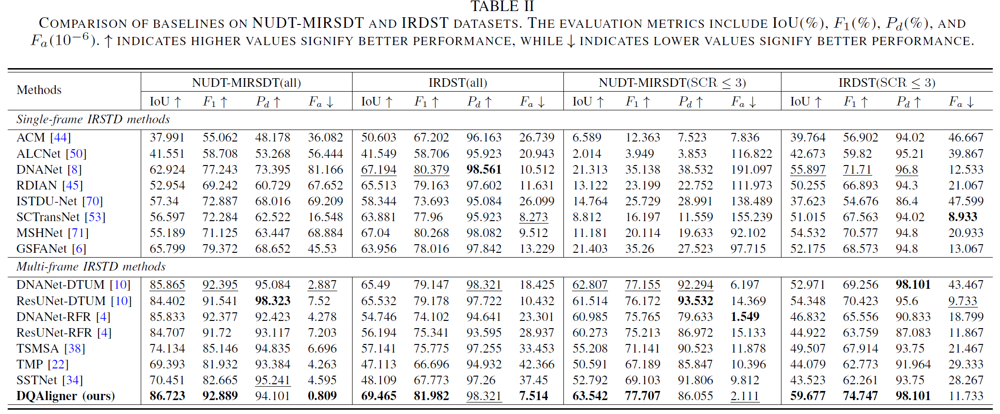
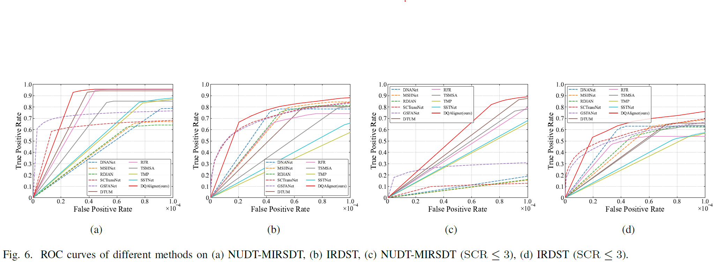

# *<center>Learning Global Dynamic Query for Large-Motion Infrared Small Target Detection</center>*

If you find this paper helpful and inspiring, please cite the following format:
```
@article{DQAligner,
  author = {Chuiyi Deng, Yanin Guo, Xiang Xu, Zhuoyi Zhao, Yixin Xia, Junwei Li, Antonio Plaza},
  title = {Learning Global Dynamic Query for Large-Motion Infrared Small Target Detection},
  year = {2025},
}
```

## Motivation



## Structure
to be updated...

## Results



## Domains
**Dataset**: 

NUDT-MIRSDT [Download](https://github.com/TinaLRJ/Multi-frame-infrared-small-target-detection-DTUM) 

IRDST [Download](https://github.com/lifier/LMAFormer) 

**Weights**: 

[Weight](results/NUDT-MIRSDT/DQAligner/weight_NUDT-MIRSDT/) for NUDT-MIRSDT

[Weight](results/IRDST/DQAligner/weight_IRDST/) for IRDST

## Requirements
- Python 3.8
- pytorch (1.10.1+cu11.1), torchvision (0.11.2+cu11.1)

## Build 
DCN Compiling
1. Cd to ```./model/dcn```.
2. Run ```bash make.sh```. The scripts will build D3D automatically and create some folders.
3. See `test.py` for example usage.

## Commands for Training
* Run `train.py` to perform network training. Example for training on [dataset_name] datasets:
  ```
  $ cd ./codes
  $ python train.py --dataset 'IRDST'
  ```
* Checkpoints and Logs will be saved to `./results/`.
<be>

## Commands for Test
* Run `test.py` to perform network inference. Example for test on [dataset_name] datasets:
  ```
  $ cd ./codes
  $ python test.py --dataset 'IRDST' --weight_path 'results/IRDST/DQAligner/weight_IRDST.pth' --save_img False
  ```
* Network preditions will be saved to `./results/`.

## Acknowledge
*This code is highly borrowed from [DTUM](https://github.com/TinaLRJ/Multi-frame-infrared-small-target-detection-DTUM). Thanks to Ruojing Li.

*This code is highly borrowed from [IRSTD-Toolbox](https://github.com/XinyiYing/BasicIRSTD) and [RFR](https://github.com/XinyiYing/RFR). Thanks to Xinyi Ying.

*This code is highly borrowed from [SCTransNet](https://github.com/xdFai/SCTransNet). Thanks to Shuai Yuan.


